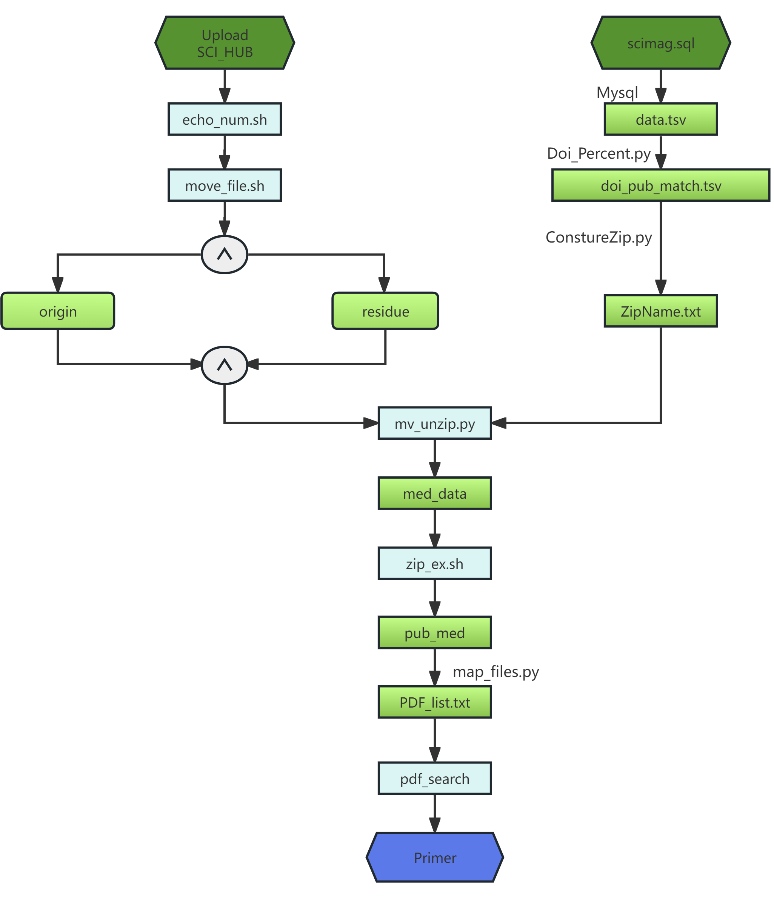

# SCI_HUB Processing
This repository contains scripts and data for processing SCI_HUB data, including checking compressed files, generating file paths, and extracting summaries from PDFs.
## Directory Structure
```plaintext
sci_hub_processing/
├── scripts/
│   ├── echo_num.sh
│   ├── move_file.sh
│   ├── Sql_cnn.py
│   ├── Doi_Percent.py
│   ├── ConstureZip.py
│   ├── mv_unzip.py
│   ├── zip_ex.sh
│   ├── map_files.py
│   └── pdf_search_v7.py
├── docs/
│   ├── ReadMe.md
│   └── SCI_HUB_Processing_Flowchart.png
```
## Processing Flowchart

Below is the flowchart of the SCI_HUB processing steps:



This flowchart provides a visual representation of the steps involved in processing SCI_HUB data, from uploading the initial files to extracting primer sequences from PDFs.

## Scripts

### 1. Checking SCI_HUB Compressed Files

- **echo_num.sh**: Counts the number of files in subdirectories.
- **move_file.sh**: Moves files based on certain criteria.

### 2. From scimag.sql to file_path.txt

- **Sql_cnn.py**: Connects to the MySQL database and generates `data.tsv`.
- **Doi_Percent.py**: Calculates the percentage of matching DOIs.
- **ConstureZip.py**: Generates the list of zip files to extract.
- **mv_unzip.py**: Moves and extracts the required zip files.
- **zip_ex.sh**: Extracts zip files.
- **map_files.py**: Generates the list of PDF files to process.

### 3. From PDF to summary.tsv

- **pdf_search_v7.py**: Extracts information from PDFs and generates `summary.tsv`.

## Usage

### Step 1: Check SCI_HUB Compressed Files
This step involves checking the compressed files within the SCI_HUB directories. It takes two parameters: the path to the parent directory and the path to the output directory. The process filters files and then counts the number of zip archives within the subdirectories. Empty directories are moved to the `zero` directory, and directories containing between 0 and 100 items are moved to the `residue` directory.
```bash
./scripts/echo_num.sh gao/mqi_1/
./scripts/move_file.sh gao/mqi_1/ .
```

### Step 2: From scimag.sql to file_path.txt

1. **Import scimag.sql(31G)**

   ```bash
   mysql -u root -p < data/input/scimag.sql
   ```

2. **Generate data.tsv**

   ```bash
   python scripts/Sql_cnn.py
   ```

3. **Calculate DOI percentages**

   ```bash
   python scripts/Doi_Percent.py
   ```

4. **Generate ZipName.txt**

   ```bash
   python scripts/ConstureZip.py
   ```

5. **Move and extract zip files**

   ```bash
   python scripts/mv_unzip.py
   ```

6. **Extract zip files**

   ```bash
   bash scripts/zip_ex.sh /s1/SHARE/sci_hub/pub_med/Mingqi/ need_ex.txt
   ```

7. **Generate pdf_list.txt**

   ```bash
   python scripts/map_files.py
   ```

### Step 3: From PDF to summary.tsv
1. Import necessary libraries and settings: Import necessary libraries such as os, time, re, csv, pandas, and PyMuPDF (fitz). Also, set up configurations such as pdf2doi library settings.
2. DOI transformation and processing: Define a series of functions to transform and process DOIs. The transform_doi function is used to convert a given DOI into a standard format; escape_doi and unescape_doi functions are for escaping and unescaping DOIs.
3. Read PDF file list: Define a function read_pdf_list to read a file containing a list of PDF file paths.
4. Check PDF file validity: Use the PyMuPDF (fitz) library to check the validity of PDF files, including file size, number of pages, and text length.
5. Extract italic text and Primer sequences: Implement a series of functions to extract italic text and Primer sequences from PDF files. These functions use the PyMuPDF (fitz) library to process PDF files. Based on specified regular expression patterns, extract italic text and Primer sequences from the text of each page.
6. Process PDF files: Implement a main function process_pdf_files, which accepts a list of PDF files, an output directory, and an object (e.g., root) as parameters, and processes each PDF file. For each PDF file, it checks its validity, then extracts DOI, italic text, and Primer sequences, and writes the results to the corresponding output file.
7. Execute the main program: In the __main__ section, specify the path to the input file (PDF file list), the path to the output directory, and call the process_pdf_files function to process the PDF files.

```bash
python scripts/pdf_search_v7.py
```
